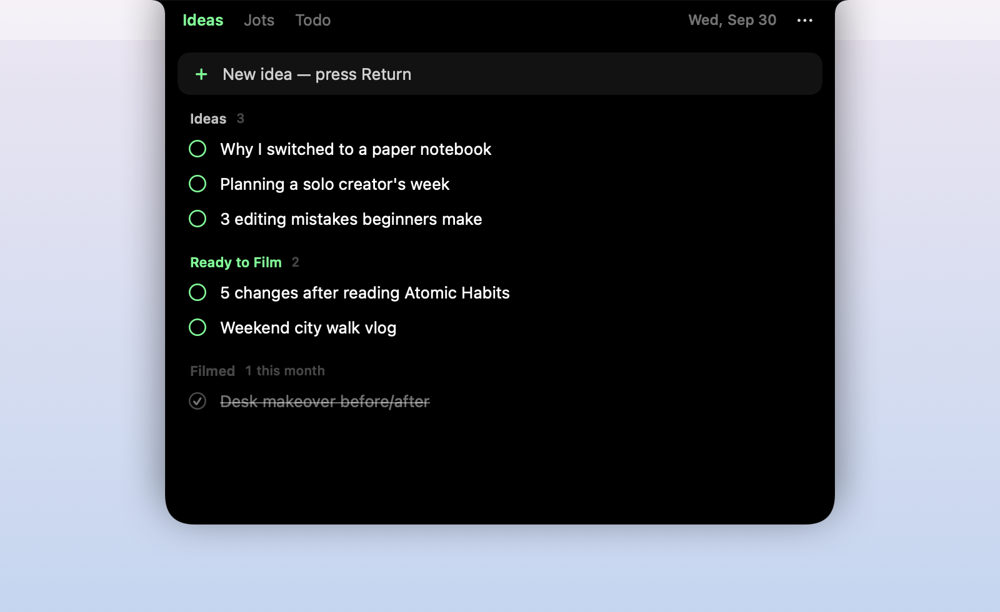
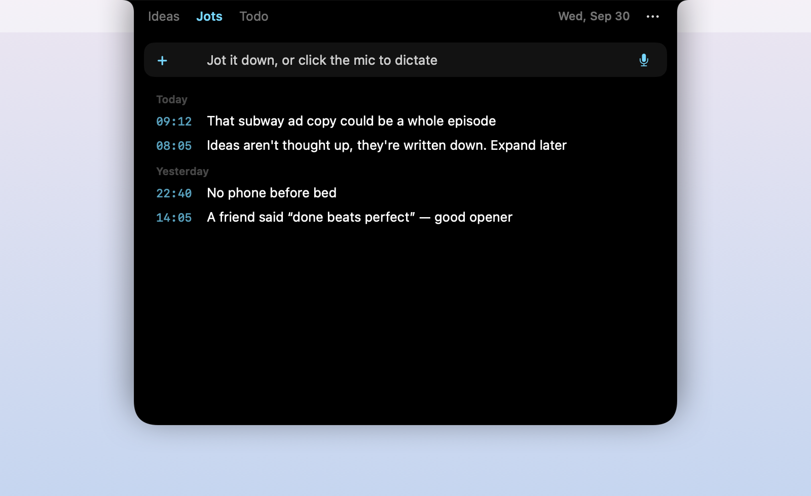
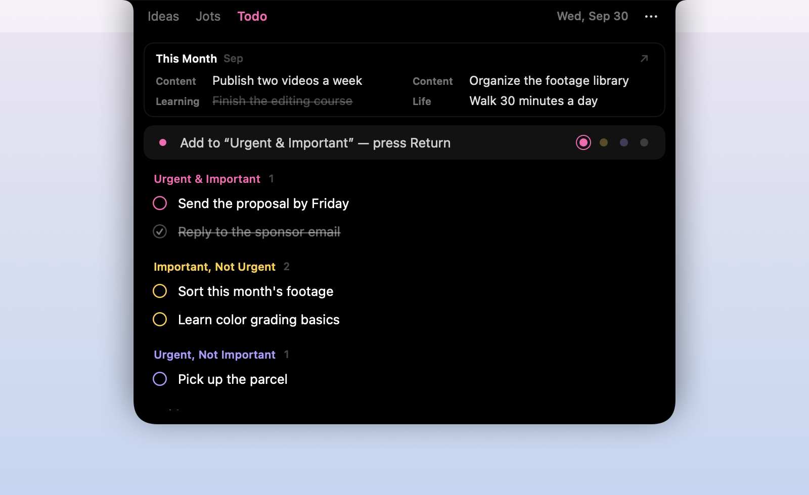

<p align="right"><a href="README.md">中文</a> · English</p>

# NotchPad

A small notepad that lives in your MacBook's notch: hover over the notch and it opens, move away and it closes.

NotchPad keeps no data of its own. Lists live in Apple **Reminders** and quick notes live in Apple **Notes**. No account, no network, and your iPhone syncs through the stock apps. If you ever stop using it, your data is still right there.

<p>
  
  
  
</p>

> This is a personal project that I update occasionally, at my own pace. Forks are very welcome — make it yours.

## What it does

- **Hover to open.** The panel grows out of the notch and hides when you leave. It stays open while you're typing.
- **Three building blocks** you combine into tabs:
  - **Pipeline** — stages you move items through, e.g. Ideas → Ready to Film → Filmed.
  - **Sections** — parallel checklists, e.g. the Eisenhower matrix, or Today / This Week / Later.
  - **Jots** — one-line notes saved to Apple Notes with a timestamp; dictation works too.
- **Pinned card** at the top of a Sections tab: shows one section of a Markdown file, like this month's goals. Obsidian users can point it at a file in their vault.
- **Click the circle** to move an item to the next stage, or **drag** it anywhere.
- Black panel with neon accents. Native Swift, about 11 MB of memory.

## Install

Requires macOS 14 or later. Best on a MacBook with a notch; on other Macs (or external displays) an invisible "notch" sits in the middle of the menu bar.

1. Download the latest `NotchPad-x.y.z.zip` from [Releases](../../releases), unzip it and drag **NotchPad** into Applications.
2. macOS will block the first launch because the app isn't signed with a paid Apple Developer ID. Either:
   - Double-click it, click **Done** on the warning, then open **System Settings › Privacy & Security**, scroll down and click **Open Anyway**; or
   - run this in Terminal:
     ```bash
     xattr -dr com.apple.quarantine /Applications/NotchPad.app
     ```
3. On first use it asks for a few permissions:

   | Permission | Why |
   |---|---|
   | Reminders | Pipelines and sections are stored there |
   | Control "Notes" | Jots are saved as notes |
   | Documents folder (maybe) | Only if your pinned card reads a file in Documents. Read-only |

4. To start it at login: **⋯ › Launch at Login** in the panel's top-right corner.

## Using it

- Return saves; in Jots, ⌥ Return adds a new line.
- **Pipeline:** click the circle to move to the next stage; on the last stage it marks the item done. Click a done item to move it back.
- **Sections:** click the circle to check an item off; it sinks to the bottom of its section (only today's are shown). The dots next to the input choose the section. Hover over an item to reveal colored dots for the other sections; click a dot to move it.
- **Edit:** click an item's text to change it in place. Return or clicking away saves; Esc cancels.
- **Drag** an item onto another section. Drop it into another app to paste its title. Right-click to move or delete.
- **Jots:** clicking into the field stamps the time; click the mic or press the 🎤 key to dictate. The list shows only the first sentence; click to open the full note.
- ⌘1 / ⌘2 / ⌘3 switch tabs; Esc closes.

**On iPhone:** just use the built-in Reminders and Notes apps. The lists and folder NotchPad creates show up there, synced through iCloud.

## Make it yours

Click **⋯** in the panel:

- **Switch Preset** — Creator / Student / Minimal. Your current config is backed up to `config.backup.json` first.
- **Edit Config…** — rename tabs, change colors, add stages, point a section at a different Reminders list… Save, and the next hover picks it up.
- **Language** — 中文 / English. Follows the system by default.

A tab in the config looks like this (from the Creator preset):

```json
{
  "type": "pipeline",
  "title": "Ideas",
  "color": "#42FF8C",
  "stages": [
    { "title": "Ideas", "list": "Content Ideas" },
    { "title": "Ready to Film", "list": "Ready to Film" }
  ],
  "doneTitle": "Filmed"
}
```

Every field and more examples: [docs/config.en.md](docs/config.en.md). Made a setup you love? Add it to `Resources/presets/` and send a pull request.

## Build from source

Needs Xcode or the Command Line Tools (`xcode-select --install`).

```bash
./build.sh             # build/NotchPad.app
./build.sh --release   # universal (Apple silicon + Intel), zipped to dist/NotchPad-<version>.zip
```

You can also open `Package.swift` in Xcode. Handy launch arguments: `--demo` (sample data, never touches Reminders or Notes), `--preset creator`, `--lang zh|en`, `--snapshot <folder>` (saves each tab as an image). See `Sources/NotchPad/AppDelegate.swift`.

## Privacy

- No network access, no analytics, no account.
- Your data stays in Reminders, Notes and any Markdown file you point the config at. The pinned card is read-only.
- Jots only ever create new notes and never rewrite existing ones; deleting moves a note to Recently Deleted.

## Known limitations

- Notes has no public API, so Jots drive the Notes app through the built-in `osascript`. If Notes isn't running, it's opened in the background the first time.
- No Apple Developer ID: you have to allow the app once when installing. If you build it yourself, macOS may ask for permissions again after each rebuild.
- Tested only on a MacBook Air running macOS 26 so far. Issues are welcome, but replies may be slow.

## License

[MIT](LICENSE)
