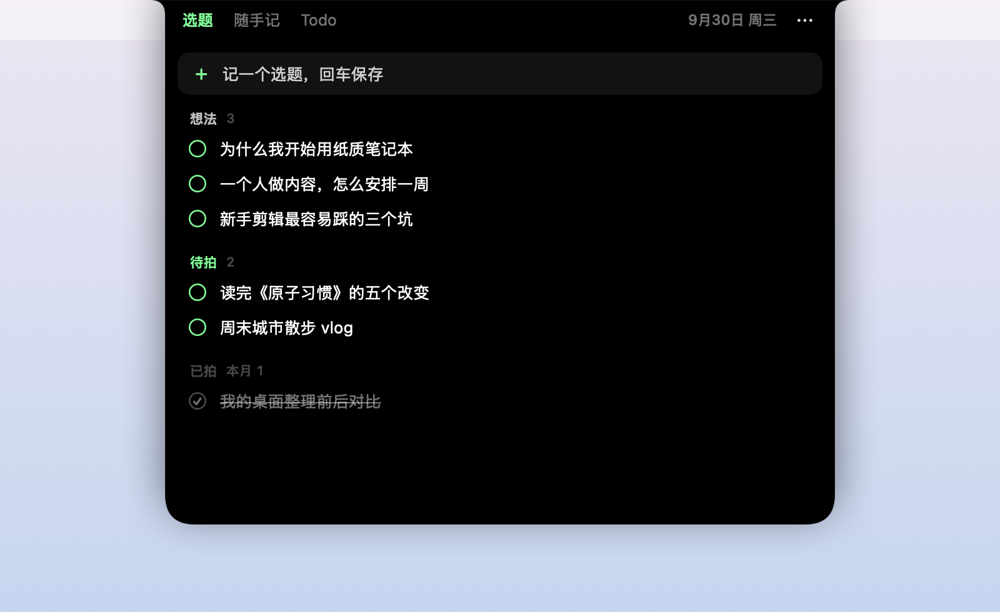
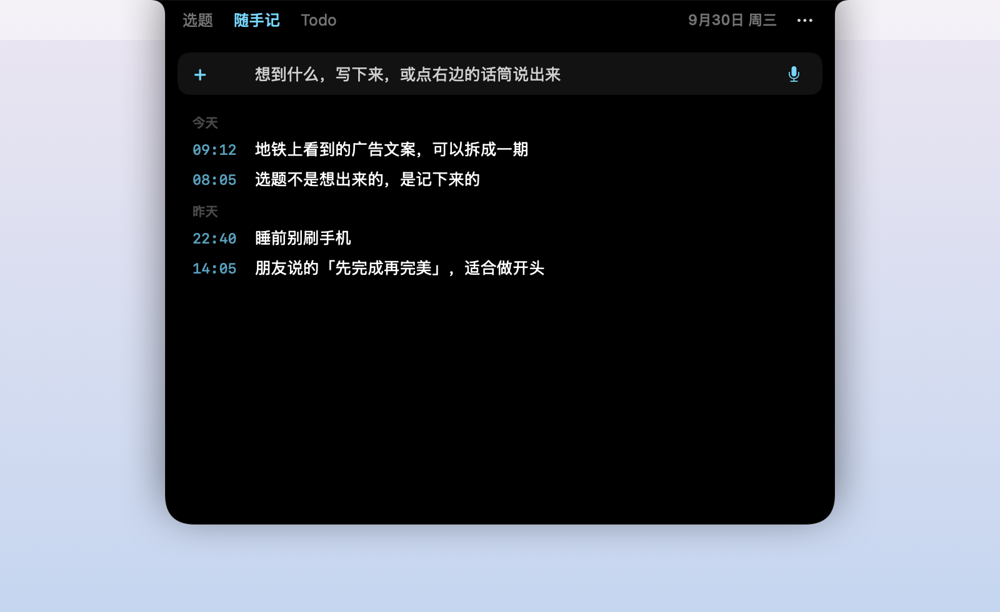
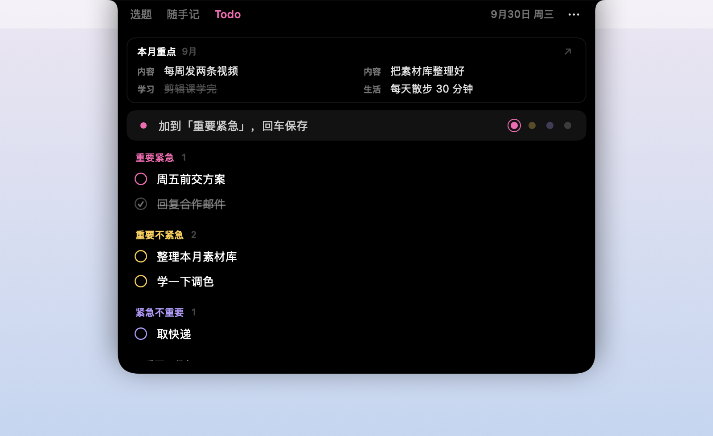

<p align="right">中文 · <a href="README.en.md">English</a></p>

# 刘海记 NotchPad

MacBook 刘海里的轻量记事板：鼠标碰到刘海就展开，移开就收起。

它自己不存任何数据：清单存在苹果自带的「提醒事项」里，速记存在「备忘录」里。所以不用注册账号，也不联网，iPhone 上用原生 app 就能同步；哪天不用了，数据都还在。

<p>
  
  
  
</p>

> 这是一个个人项目，我会按自己的节奏偶尔更新。欢迎 fork，改成你自己的版本。

## 它能做什么

- **碰一下就展开**：鼠标移到刘海，面板从刘海里长出来；移开就收起。正在打字时不会收起。
- **三种积木，自由拼成 tab**
  - **流水线**：几段按顺序往下走，比如 想法 → 待拍 → 已拍。
  - **分段清单**：几段并列的待办，比如四象限，或者 今天 / 本周 / 以后。
  - **速记**：一句话写进备忘录，自动记下时间，也可以用语音输入。
- **置顶卡片**：在分段清单顶上显示一个 Markdown 文件里的某一节，比如这个月的重点。用 Obsidian 的话，可以直接指向库里的文件。
- **点圆圈往下一段走**，也可以按住直接拖到别的段。
- 黑底荧光色，原生 Swift 编写，常驻内存约 11 MB。

## 安装

需要 macOS 14 或更新版本。有刘海的 MacBook 效果最好；没有刘海的 Mac（或外接显示器）会在菜单栏正中放一个看不见的「刘海」。

1. 到 [Releases](../../releases) 下载最新的 `NotchPad-x.y.z.zip`，解压后把「刘海记」拖进「应用程序」文件夹。
2. 第一次打开会被 macOS 拦住，因为这个 App 没有付费的苹果开发者签名。按下面任选一种方式放行：
   - 双击打开，看到提示后点「完成」；再打开 **系统设置 › 隐私与安全性**，拉到最下面，点「仍要打开」，输入开机密码。
   - 或者打开「终端」，运行：
     ```bash
     xattr -dr com.apple.quarantine /Applications/NotchPad.app
     ```
3. 第一次用的时候会弹几个授权，都是它干活需要的：

   | 授权 | 为什么需要 |
   |---|---|
   | 提醒事项 | 流水线和分段清单都存在这里 |
   | 控制「备忘录」 | 速记存成备忘录里的笔记 |
   | 文稿文件夹（可能会问） | 只有当置顶卡片读的文件放在「文稿」里时才需要，只读不改 |

4. 想开机就能用：点面板右上角的 **⋯ › 开机时启动**。

## 用法

- 回车保存；速记里按 ⌥ 回车换行。
- **流水线**：点圆圈往下一段走，最后一段再点一下就是完成；完成的再点一下会退回去。
- **分段清单**：点圆圈勾掉，勾掉的沉到这一段下面（只显示今天勾掉的）。输入框右边的小圆点选加到哪一段。
- **修改**：点一下某条的文字可以直接改，回车或点别处保存，Esc 取消。
- **拖动**：按住一条拖到别的段；拖到别的 app 里会粘贴它的标题。右键也能移动、删除。
- **速记**：点进输入框就记下这一刻的时间；点话筒或按键盘上的 🎤 键说话。列表里只显示第一句，点一下在备忘录里打开全文。
- ⌘1 / ⌘2 / ⌘3 切换 tab；Esc 收起。

**手机上**：直接用 iPhone 自带的提醒事项和备忘录。刘海记建好的列表和文件夹会出现在那里，两边通过 iCloud 同步。

## 定制

点面板右上角的 **⋯**：

- **换一套预设**：创作者 / 学生 / 极简。原来的配置会先备份成 `config.backup.json`。
- **编辑配置文件**：改 tab 的名字和颜色、分几段、对应提醒事项里的哪个列表……保存之后，下次展开刘海就生效。
- **界面语言**：中文 / English。默认跟系统语言走；系统是英文但想用中文，在这里切换就行。

配置文件长这样（「创作者」预设里的第一个 tab）：

```json
{
  "type": "pipeline",
  "title": "选题",
  "color": "#42FF8C",
  "stages": [
    { "title": "想法", "list": "选题" },
    { "title": "待拍", "list": "待拍" }
  ],
  "doneTitle": "已拍"
}
```

每个字段的意思和更多例子见 [docs/config.md](docs/config.md)。做了一套好用的配置，欢迎放进 `Resources/presets/` 提交给我，分享给更多人。

## 从源码编译

需要 Xcode 或 Command Line Tools（`xcode-select --install`）。

```bash
./build.sh             # 生成 build/NotchPad.app
./build.sh --release   # Apple 芯片 + Intel 通用版，打包成 dist/NotchPad-<版本>.zip
```

也可以用 Xcode 打开 `Package.swift` 改代码。调试时有几个启动参数：`--demo`（示例数据，不碰提醒事项和备忘录）、`--preset creator`、`--lang zh|en`、`--snapshot 文件夹`（把每个 tab 存成图片），详见 `Sources/NotchPad/AppDelegate.swift`。

## 隐私

- 不联网，没有统计，没有账号。
- 数据只在提醒事项、备忘录，以及你在配置里指定的 Markdown 文件里。置顶卡片只读，从不写入。
- 速记只会新建笔记，从不改写已有的笔记；删除会移到备忘录的「最近删除」。

## 已知限制

- 备忘录没有给第三方开放接口，速记是通过系统自带的 `osascript` 控制备忘录 App 实现的。第一次读取时如果备忘录没开，它会在后台被打开。
- 没有苹果开发者签名：安装时要手动放行一次。自己编译的话，每次重新编译后系统可能会再问一次授权。
- 目前只在 macOS 26 的 MacBook Air 上测试过。遇到问题欢迎开 issue，不过回复可能会比较慢。

## 许可

[MIT](LICENSE)
